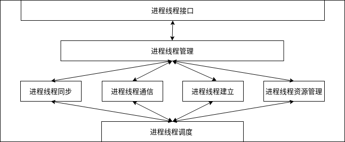
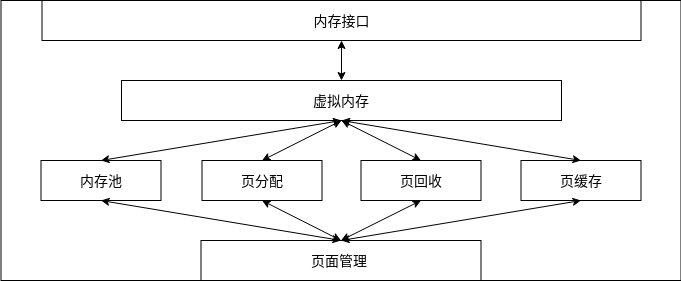

## Cosmos的“Ψ(Psi)”架构

Cosmos的“Ψ(Psi)”架构是一个全新的操作系统架构，它有别于传统操作系统架构。应该说Cosmos的“Ψ(Psi)”架构是吸收了传统操作系统架构高性能的优势，完全摒弃了传统操作系统内核的高内聚高偶合，低安全性，不易扩展，牵一发而动一身的不足。

那么怎么摒弃传统操作系统的不足呢，答案是：降低Cosmos内核的代码量，Cosmos的“Ψ(Psi)”架构的内核代码量，控制在3万行左右，降低代码量就是降低工程规模，因为代码量越大，出问题的可能性越大，反之亦然，在一个较小的工程规模下，我们就能验证每一行代码的正确性。然而，传统操作系统有一个最大的优势就是性能，这既是传统操作系统内核代码模块高内聚高偶合带来的效果，也是几十年来CPU硬件厂商和传统操作系统厂商根据自身的缺点，在现有生态环境下互相优化导致的结果。

Cosmos的“Ψ(Psi)”架构总体上，分成了两层：

1. 用户层：运行各种应用，应用则通过API库，请求内核服务。
2. 内核层：Cosmos的“Ψ(Psi)”架构的核心，提供了一个操作系统的基础服务。

可以发现，Cosmos操作系统的各种驱动、系统服务变成了用户态服务进程，这大大降低偶合度，这些进程可以允许崩溃，替换，而不会给系统带来灾难性后果。这样的话，不就有了性能损失吗，因为传统操作系统中驱动和系统服务是内核的一部分，这带来极大的性能优势同时也带来了安全隐患，Cosmos的“Ψ(Psi)”架构如此设计就是规避这个缺陷，而同时又能保证高性能。

## 高性能

Cosmos的“Ψ(Psi)”架构从两个方面保证了高性能。

1. Cosmos的“Ψ(Psi)”架构的内核提供了一个应用程序使用密集度最高的服务。

   进程：这是应用程序运行实例的抽象，也是对CPU这个物理资源最为直接的抽象，应用程序要运行必须要建立一个进程。

   对象：应用程序要通信，要同步，要访问各种系统资源，这是由对象管理器提供的服务，也由Cosmos内核直接提供。

   内存：应用程序要运行，还有一个重要的资源同，那就是地址空间，应用要运行就必须访问内存地址空间的数据，这是由Cosmos内核的内存组件提供。 

2. 硬件级IPC。

   全新设计了CPU架构，实现了硬件级的IPC通信机制，从硬件层规避了系统服务、驱动进程进行IPC通信时带来的性能损失。 

## 对象

一个应用要和内核或者其它应用发生交互，就要创建相应的对象，一个对象有对象句柄和对象实体，一个对象句柄能访问到相关的对象。对象层支持创建或者访问多种不同对象，如：安全对象、进程对象、内存对象、IPC通信对象等，每种类型的对象有各自不同的功能。

#### 对象接口

该模块，提供了所有与对象相关的接口，例如对象的建立、删除、打开、关闭、读、写、通信等操作，对上层和内核其它组件提供这些接口对应的服务，完成对应的功能。

#### IPC同步、异步通信对象

这是一种用于通信的对象，用于应用和应用之间，应用和内核之间通信，通信的方式有两种，一种是同步通信，这种情况应用会等待，一种是异步通信，这种情况下应用不会进入等待，但是会收到异步通信完成的通知。 

#### 安全对象

安全对象是用于应用访问其它进程或者内核自身资源的一种特殊对象，通过安全对象应用程序可以在内核的协助下完成一些特殊操作，如访问设备寄存器，访问共享内存，同步等。

#### 通用对象

这是一种由应用和应用之间协商的对象，这种对象内核不定义其功能，内核只是创建这种对象，功能由应用定义。 

#### 内存对象

这种对象表示一段内存地址空间，由内核建立，应用进程分配内存时创建。 

#### 进程线程对象

这是两种对象，内核或者应用通过建立这样的对象以建立一进程或者线程，进程是应用程序的资源容器，而线程是应用程序的执行流实体，一个进程对象可以包含一个或者多个线程对象。

#### 对象管理

负责各种对象的建立、删除、查找、修改、组织等功能操作。

## 进程

一个应用程序要在Cosmos系统上运行，必须要一个对应的进程和线程，用进程来作为对应应用程序的资源容器，例如CPU时间，内存、网络等资源，这在内核角度来说是内核的核心机制，在用户角度来看，这是用户使用最频繁的操作系统服务，因为用户总是不断的运行或者关闭应用程序。所以我们不把这种核心服务也独立在内核之外，而是作为内核的核心功能存在，这样的高内聚带来了极致的性能。

#### 进程线程接口

提供建立进程线程、删除进程线程、设置、查询进程线程数据状态等进程线程相关的全部服务接口，以便内核和应用程序使用。并且内核的其它组件和应用程序只能使用这里暴露出来的接口。 

#### 进程线程管理

主要负责如保表示进程线程、查找、组织进程线程。比如表示一个进程或者线程就要设计进程或者线程对应的数据结构，组织进程和线程就要设计进程表之类的，这是进程组件内部的操作。

#### 进程线程同步

主要负责进程或者线程之间同步，主要实现是各种锁、互斥体、信号量等重要机制。通过这些机制来控制进程或者线程的运行、等待、唤醒等操作，达到进程或者线程之间同步的目的。

#### 进程线程通信

主要负责进程或者线程之间通信，主要是IPC通信链路对象，消息盒子、共享内存，通过这些机制来允许进程或者线程之间、互相发送消息或者数据，这样就能使进程或者线程之间互相通信了。

#### 进程线程建立

主要是负责进程或者线程的建立和删除。

#### 进程线程资源管理

进程和线程在运行过程中会使用各种系统资源，如虚拟内存空间和物理内存页面，文件数据、各种类型的对象，这些资源都要合理的管理，它们的申请、释放、查找等操作，由进程线程资源管理负责。 

#### 进程线程调度

Cosmos系统是多进程、多线程的操作系统内核，并且支持多CPU，支持多计算结点，所以要实现进程或者线程间调度，多CPU间调度、多计算节点间调度，包含要实施的适合各种应用情景下的调度器，即调度算法。

## 内存

无论是操作系统内核还是应用软件，要想运行就必须先装载到内存，可以这样说，程序代码的运行首先与其打交道的是内存，而不是CPU，所以操作系统的内存管理是重中之重，内存管理是否高效往往决定着一款操作系统的性能优劣与否。所以我们把这种内存管理的核心服务也同样集成在内核之中，这样的高内聚带来高性能。其实进程线程和对象，它们的低层实施都需要使用内存管理服务，因为它们的数据结构实现变量都需要内存空间来存放。所以内存在进程和对象之下，而内存服务，则分为虚拟内存和物理内存，分别完成不同的服务。

#### 内存接口

提供分配释放虚拟内存、分配释放内存池空间、分配释放物理内存页面、内存映射、内存锁定等内存相关的全部服务接口，以便内核和应用程序使用。并且内核的其它组件和应用程序只能使用这里暴露出来的接口。 

#### 虚拟内存

提供内核和应用进程的虚拟内存空间，一个进程拥有完整的虚拟地址空间，这些空间本不能直接访问，只有通过分配了虚拟空间对象才能映射到物理内存，最后才能访问。所以虚拟内存主要负责虚拟空间的分配、释放、映射等功能操作。

#### 内存池

Cosmos内核在运行过程中，会动态分配各种对象，各种数据结构，这直接导致内核自身需要动态分配内存，但是这个内存空间比一个内存页面小的多，为了不浪费内存，所以提供的内存池机制，它主要实现小于一个物理内存页面空间的内存分配、释放请求。

#### 页分配

主要实现一个或者多个连续的物理内存页面分配，释放。

#### 页回收

主要实现在物理内存不足时，对物理内存页面进行回收。

#### 页缓存

主要实现利用空闲内存来缓存大量高频率使用的数据，例如消息数据、对象数据等。这样可以大大提高性能。

#### 页面管理

管理系统全局物理内存页面，实现全局物理内存页面的统计、预留，锁定与设置全局物理内存页面的状态。

## 硬件抽象层  

计算机领域的一个基本方法是增加一个抽象层，从而使得抽象层的上下两层独立地发展。硬件抽象层，就是要把操作硬件和处理硬件功能差异的代码抽离出来，形成一个独立的软件抽象层，对外提供相应的接口，方便上层开发。如果把所有硬件平台相关的代码，都抽离出来，放在一个独立硬件相关层中实现并且定义好相关的调用接口，再在这个层之上开发Cosmos内核的其它功能代码，就会方便得多，结构也会清晰很多。操作系统的移植性也会大大增强，移植到不同的硬件平台时，就构造开发一个与之对应的硬件抽象层。比如我们要把Cosmos移槙到x86硬件平台上，就构造一个x86硬件抽象层，再比如把Cosmos移槙到RISCV硬件平台上，就构造一个RISCV硬件抽象层。

#### hal接口

提供硬件抽象层接口，以供Cosmos内核使用，它们包含中断、虚拟化、同步、IPC、Cache、CPU特殊功能、MMU、Boot初始化、平台固件所有接口。

#### 中断

每个硬件平台，触发中断、响应中断、处理中断、中断数量、中断类型与优先级，还有中断控制器的操作方式，完全是各不相同，所以这些功能放在硬件抽象层中实现，向上层提供接口，比如其它上层组件关闭中断，，提供中断相关功能服务。 

#### 虚拟化

每个硬件虚拟化的实现技术，都是特定于具体的平台芯片的。故放在硬件抽象层中实现。提供硬件虚拟化功能服务。

#### 同步

同步原语的实现，依赖于特定CPU的指令，也是硬件抽象层的功能，提供同步原语功能。

#### IPC

Cosmos是需要硬件级的IPC功能的，现在只有自主设计的CPU才有这样的扩展指令，并不是通用CPU所具备的，这在平台移植时可以通过硬件抽象层用软件方式实现一个低性能版的IPC，提供IPC功能服务。

#### Cache

现在Cache包含在各CPU的内存，怎么开启关闭Cache、怎么刷新Cache、使Cache无效，都是特定CPU相关的，这也是属于硬件抽象层的功能。提操控Cache的功能服务。 

#### CPU

有很多CPU除了能执行指令外，还能完成一些特殊功能，例如性能监视，调试，温度速度调整等，这些属于特定型号系列的CPU的功能，所以放在硬件抽象层来实现这些功能，提供CPU特殊功能服务。

#### MMU

MMU是内存管理单元，通过页表完成虚拟内存地址到物理内存地址映射转换，然而每个硬件平台的MMU不尽相同，所以把MMU功能放在硬件抽象层中实现，向上层提供接口，比如内存组件调用这个MMU相关接口完成内存映射，提供MMU相关功能服务。

#### Boot

实现平台的引导和初始化功能，每个平台引导不尽相同，所以这些属于硬件抽象层的功能。  

#### 平台固件

有些硬件并不愿意公开编程细节，或者硬件可能有问题，这些都是通过平台固件提供的，我们只能调用平台固件的接口完成相应的功能。比如x86平台的BIOS。 